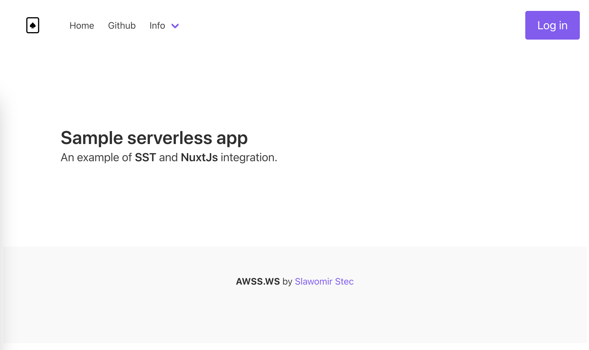
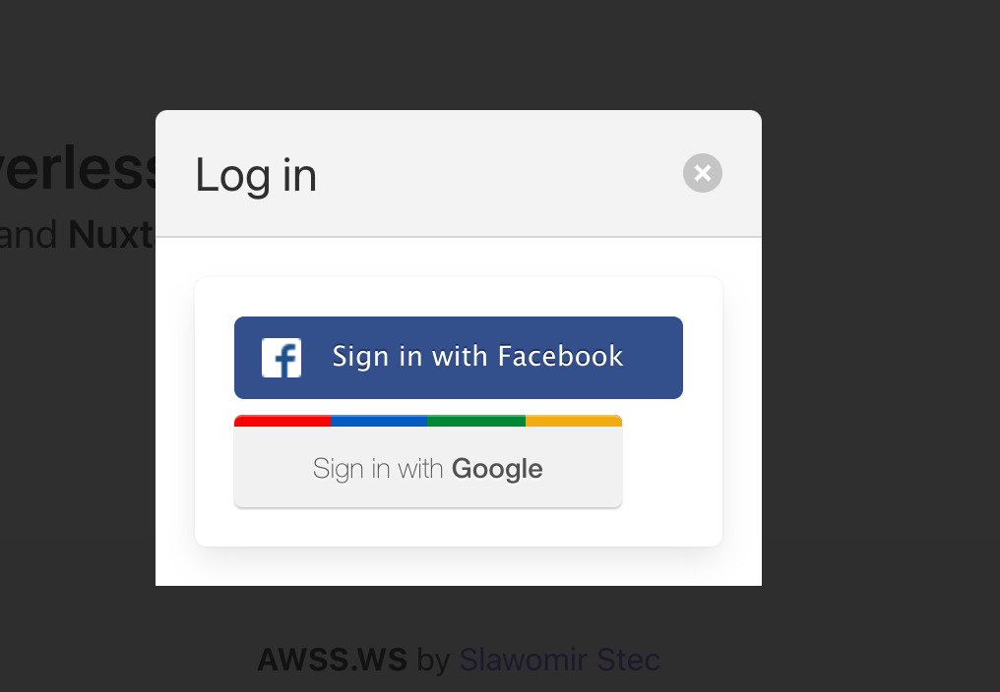
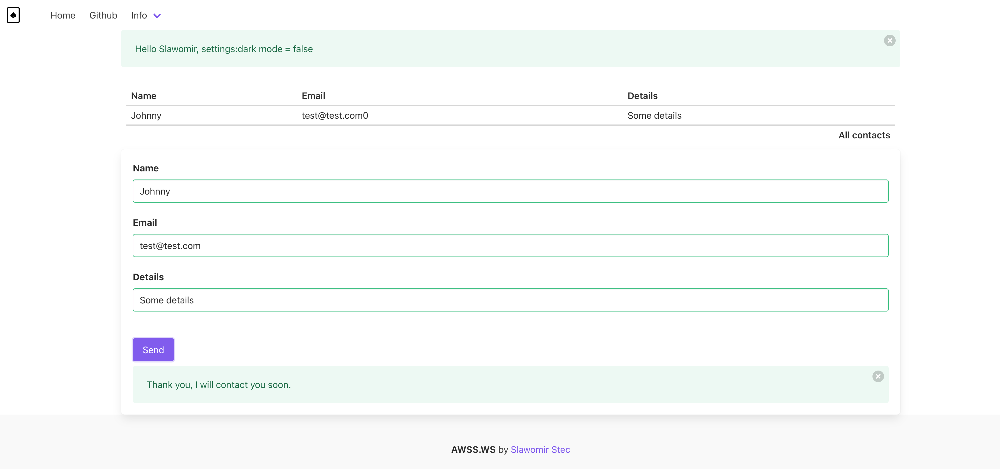

#### What is it?

SPA build with serverless stack framework. Client side build with Vue and NuxtJS.
Backend is Api Gateway + Lambda + DynamoDb + Cloudfront.

More details on the blog [slawomirstec.com](https://slawomirstec.com)

.
.
.

#### Preparation

This project includes defaults for domain: awws.ws, change it to your own.

1. Create new Route53 hosted zone with name: awss.ws

   Change name server for your domain to point to the new zone nameserver.

   This is required for domains registered with other provider than AWS.


2. Copy template.env to .env file. Exclude it from git. Fill all values.

   Create developer applications for facebook and google, copy client and secret ids to env files.
 
   For example Facebook setup values:

```
App Domains
api.awss.ws
api.awss.ws/v1
```   

```
Website -> Valid OAuth Redirect URIs
https://api.awss.ws/v1/authenticate/oauth-step1
``` 

Update constants.js for frontend app.

#### Build

```
Start by installing the dependencies.
```bash
$ yarn install
```

#### Production deployment 
```bash
$ yarn deploy --stage prod
```

#### Development with live lambda reload

```bash
$ yarn start
```

#### Run unit and integration tests

```bash
$ yarn test
$ yarn integ-test
```

#### Frontend (localhost:3000)
```bash
$ cd frontend
$ yarn install
$ yarn run dev
```
